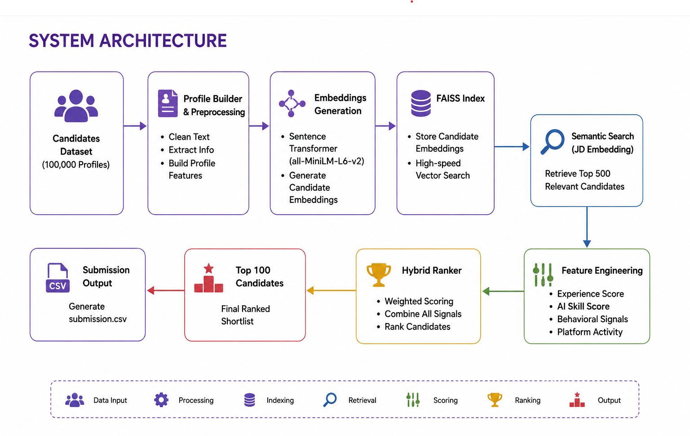
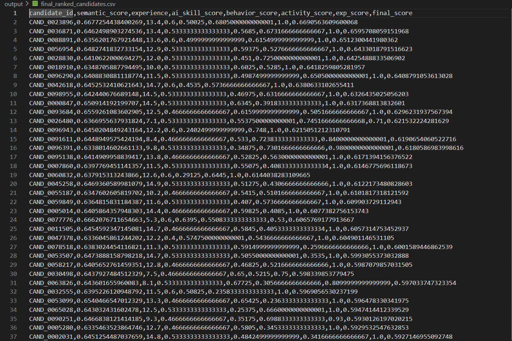

# 🚀 Redrob AI Ranker

> AI-powered candidate ranking system that combines semantic search, behavioral signals, platform activity, and hybrid scoring to intelligently match talent with job requirements.

Built for the **India Runs Data & AI Challenge 2026**.
## 📌 Overview

Redrob AI Ranker intelligently ranks job candidates by understanding both the **job description** and **candidate profiles**, rather than relying on simple keyword matching.

The system combines semantic similarity, AI skill evaluation, behavioral signals, platform activity, and experience to generate an explainable shortlist of the best candidates.

---

## ✨ Features

* 📄 Job Description Understanding
* 🔍 Semantic Candidate Search using Sentence Transformers
* ⚡ FAISS Vector Search for efficient retrieval
* 🤖 Hybrid AI Ranking Model
* 👤 Behavioral Signal Analysis
* 📈 Platform Activity Scoring
* 🎯 Dynamic Weight Selection based on Job Requirements
* 📝 Explainable Candidate Recommendations

---


## 🏗️ System Architecture



---
## 📊 Sample Output

The hybrid ranking model evaluates semantic similarity, experience, AI skills, behavioral signals, and platform activity to generate an explainable ranking of the best candidates.


## 🧠 Ranking Strategy

The final score combines multiple candidate quality indicators.

| Component           | Description                                          |
| ------------------- | ---------------------------------------------------- |
| Semantic Similarity | Candidate relevance to the job description           |
| AI Skill Score      | AI/ML skill strength                                 |
| Experience Score    | Relevant work experience                             |
| Behavioral Score    | Recruiter engagement and hiring signals              |
| Activity Score      | GitHub activity, endorsements and profile engagement |

The system dynamically adjusts scoring weights depending on the job description.

---

## 🛠️ Tech Stack

* Python
* Sentence Transformers
* FAISS
* Pandas
* NumPy
* Scikit-learn

---

## 📂 Project Structure

```
Redrob_AI_Ranker/
│
├── data/
├── src/
├── output/
├── requirements.txt
├── README.md
└── submission_metadata.yaml
```

---

## ▶️ How to Run

Create a virtual environment

```bash
python -m venv venv
```

Activate it

**Windows**

```bash
venv\Scripts\activate
```

Install dependencies

```bash
pip install -r requirements.txt
```

Build candidate profiles

```bash
python src/build_profiles.py
```

Generate embeddings

```bash
python src/generate_embeddings.py
```

Retrieve semantic matches

```bash
python src/retrieve_top500.py
```

Extract candidate features

```bash
python src/export_features.py
```

Generate behavioral scores

```bash
python src/calculate_behavior.py
```

Generate activity scores

```bash
python src/calculate_activity.py
```

Run hybrid ranking

```bash
python src/hybrid_ranker.py
```

Generate Top 100

```bash
python src/generate_top100.py
```

Create submission

```bash
python src/create_submission.py
```

---

## 📊 Output

The system generates:

* Top 500 semantic matches
* Final ranked candidate list
* Top 100 shortlisted candidates
* Submission CSV with explanations

---

## 🎯 Challenge Goal

Build an AI-powered hiring assistant capable of understanding job requirements and recommending the most suitable candidates using semantic search and intelligent ranking.

---

## 👨‍💻 Author

**Ponnam Raja Shekar**

Built for the **India Runs Data & AI Challenge 2026**.
